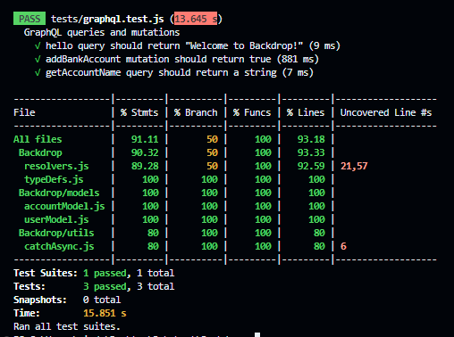

# Backdrop Engineering Challenge

## Question
> In 100 words or less, provide an answer to this in your readme: What's a good reason why  the pure Levenshtein Distance algorithm might be a more effective solution than the broader Damerau–Levenshtein Distance algorithm in this specific scenario. 

## Answer
> The pure Levenshtein Distance algorithm might be a more effective solution than the Damerau–Levenshtein Distance algorithm in scenarios where transpositions are not a common typing mistake. In this given scenario, where a user might accidentally type their bank account name with one letter off or the bank might have stored their name with one letter off, I don't think transpositions are a common typing mistake. So, using the pure Levenshtein Distance algorithm can still effectively verify users who have an input that is within a Levenshtein Distance of 2 from what is provided by Paystack.

## Tech Stack
### Main Dependencies
 * **node.js** and **express** as the JavaScript runtime environment and server framework.
 * **mongodb** as a database of choice.
 * **mongoose** as an ODM library of choice.
 * **apollo-server-express** as the GraphQL server of choice.
 * **graphql**- a query language for APIs.
 * **graphql-tools**- includes useful tools to create, test and manipulate GraphQL schemas.
 * **jest**- JavaScript Testing Framework.

## Main Files: Project Structure

  ```sh
  ├── README.md *** Instructions on how to set-up the project locally and API reference.
  ├── package.json *** The dependencies to be installed with "npm install"
  ├── server.js *** Entry point of the app
  ├── typeDefs.js
  ├── resolvers.js
  ├── db.js
  ├── .env
  ├── example.env
  ├── models
  │   ├── userModel.js
  │   ├── accountModel.js
  ├── tests
  │   ├── graphql.test.js
  ├── data
      ├── import-data.js *** File to be run independently to populate the "user" collection with users data or to offload the "user" collection.
      └── users.json
```

## Getting Started Locally

### Prerequisites & Installation
To be able to get this application up and running, ensure to have [node](https://nodejs.org/en/download/) installed on your device.

### Development Setup
1. **Download the project locally by forking this repo and then clone or just clone directly via:**
```bash
git clone https://github.com/omobolajisonde/Backdrop-EC.git
```
2. **Create a .env file just like the example.env**
   - Assign the `SECRET_KEY` variable a test API key to use with the Paystack API. You will need a free unverified Paystack account (to get test API keys).

3. **Set up the Database**
   - Create a MongoDB database on your local MongoDB server or in the cloud (Atlas).
   - Copy the connection string and assign it to the `DATABASE_URI` environment variable.
   - Do the above two steps for the `TEST_DATABASE_URI` too.
   - On connection to the database, two collections - `users` and `accounts` are created.
   - In your terminal `cd` to the data directory and type the command `node import-data.js --import` to populate the `users` collection with users data. If you want to offload the `users` collection, still in the data directory, type the command `node import-data.js --offload`. Don't forget to also change the `DATABASE_URI` in `db.js` to the `TEST_DATABASE_URI` to also populate the `users` collection in the test DB.
  
## Models
---

### User
| Field  |  Data type | Description |
|---|---|---|
|  _id |  ObjectId |  auto-generated |
|  name | String  |  required |
|  email | String  |  required, unique |
|  role | String  |  It can either be "admin" or "user". Defaults to "user". |
|  is_verified  |  Boolean | Defaults to false |
|  createdAt |  Date |  Defaults to current timestamp |
|  updatedAt |  Date |  Defaults to current timestamp |

### Account
| Field  |  Data type | Description |
|---|---|---|
|  _id |  ObjectId |  auto-generated |
|  user_account_number |  String | required, unique |
|  user_bank_code | String  | required |
|  user_account_name | String  | required |
|  user_id  | ObjectId (ref: User) | Used to map a bank account to a User. |
|  createdAt |  Date |  Defaults to current timestamp |
|  updatedAt |  Date |  Defaults to current timestamp |


4. **Install the dependencies** from the root directory, in terminal run:
```
npm install
```

5. **Run the development server:**
```bash
npm run dev
```
6. **At this point, your server should be up and running** at [http://127.0.0.1:5000/](http://127.0.0.1:5000/) or [http://localhost:8080](http://localhost:8080)

---

## Viewing the application in a browser
Visit http://127.0.0.1:5000/ or http://localhost:8080/ on your browser.

---
## Testing
In order to run tests, navigate to the root directory and run the following commands:
``` bash
npm test
```

>**Note** - All tests are in the `tests` folder.

## API Reference
### Endpoints
`/graphql`

### Query Types
`hello`

Returns a simple greeting message when called.

`getAccountName`

Returns the account name associated with a given bank account number and bank code. This query has the following parameters:

- `bank_code`: A required parameter for the user's bank code. This field takes a String as an input.

- `account_number`: A required parameter for the user's bank account number. This field takes a String as an input.

### Mutation Types
`addBankAccount`

Adds a new bank account to the system. This mutation has the following parameters:

- email: A required parameter for the user's email address. This field takes a String as an input.
  
- accountDetails: A required parameter for the user's account details. This field takes an object in the format below:
```json
{
    "user_account_number": "1234567890",
    "user_bank_code": "123", 
    "user_account_name": "John Doe"
}
```

## Example Usage

### Query Example

```
query {
  hello
  getAccountName(bank_code: "123", account_number: "4567890")
}
```

### Mutation Example

```
mutation {
  addBankAccount(email: "user@example.com", accountDetails: { user_account_number: "1234567890", user_bank_code: "123", user_account_name: "John Doe" })
}
```
## Deployment
https://backdrop-ec.onrender.com

## Authors
[Sonde Omobolaji](https://github.com/omobolajisonde) 

## Acknowledgements 
The awesome team at [Backdrop](https://backdrop.photo/).